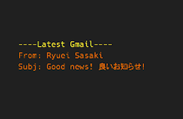

# Gmail widget for Übersicht

Here it comes, a new year and a new widget. Let's make 2017 a good year! I'll start small.

This is an Übersicht widget that displays the sender and the subject line of the latest email delivered to your Gmail inbox. At the moment, it displays the gmail of the account has your Google API client id/client secret that you use with this widget.



## Setup:
1. Perhaps obvious but you would need a google account
2. Go to https://console.developers.google.com > click on API Project > select Create project > fill in your project name > click on create
3. Make sure you are in API Manager
4. Select Credentials > select Create credentials > select OAuth client ID > select Other > fill in the name such as ubersicht > copy client ID and client secret > paste them in the gmail.coffee file after CLIENT_ID: and CLIENT_SECRET: They are located on the top. Note that you would need to store them as string i.e. surround them with ```""```. 
The cred file should look like the following```
CLIENT_ID: "your_client_id"
CLIENT_SECRET: "your_client_secret"
AUTHORIZATION_CODE:
```
5. Go to OAuth consent screen > fill in/choose your gmail address > fill in Product name shown to users with the same name that you chose in the step 2 above > make sure to save
6. Saving your script should launch a web browser asking whether you would like to allow your app to view gmail. Click Allow and the next screen will show a code. Please copy and paste it in the cred file besides AUTHORIZATION_CODE:. In case a browser does not launch please click on Refresh All Widgets option found in Ubersichts icon on your mac menu bar.

## Notes:
- Make sure to name the project name (where you get your client ID and client secret) the same as the oauth product name. Else it seems to return an error when obtaining authorization code.

## Credits:
parsej.sh is made by the devs at ShellShoccar-jpn. Huge thanks to ShellShoccar-jpn.
https://github.com/ShellShoccar-jpn/Parsrs/blob/master/parsrj.sh

## Disclaimer:
This widget, especially the oauth.sh is still at beta stage. Please use at your own risk. I would also highly appreciate constructive feedback. Many thanks.

## To-do:
- display multiple emails?
